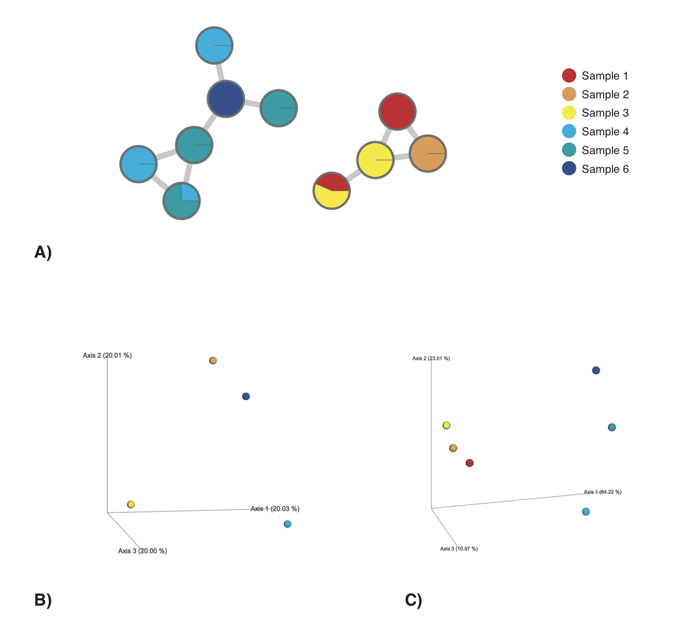
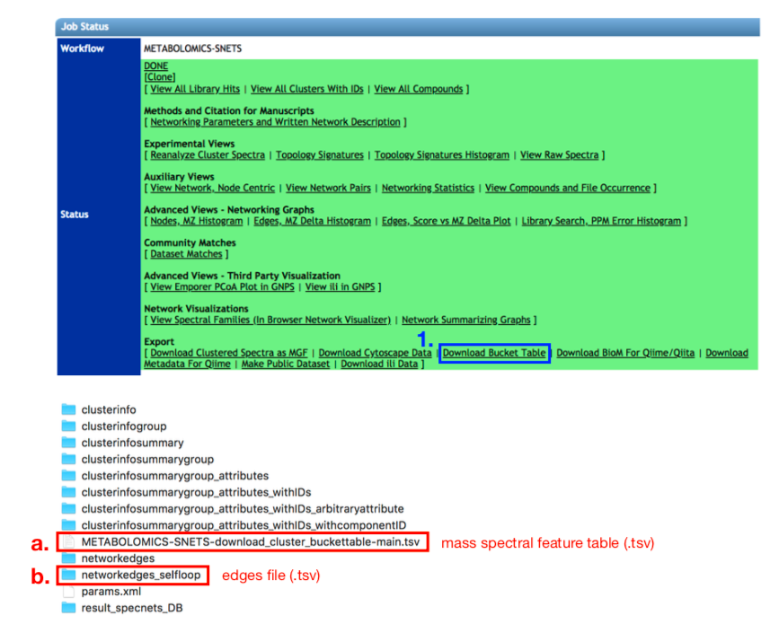

## Installation

Once QIIME2 is [installed](https://docs.qiime2.org/2018.2/install/), and you activated your QIIME2 environment, you can install `q2-cscs` with:

```
conda install -c askerdb q2-cscs 
qiime dev refresh-cache
```

## Why use the chemical structural and compositional similarity (CSCS) distance metric over traditional distance metrics for metabolomics data?


The chemical structural and compositional similarity (CSCS) is a measure of chemical similarity proposed by [Sedio and coworkers](https://esajournals.onlinelibrary.wiley.com/doi/abs/10.1002/ecy.1689). It is a metric, which takes into account the chemical structural relatedness of the compounds detected and can be applied to metabolomics samples, which have been acquired on a tandem mass spectrometer (MS/MS) and submitted to mass spectral molecular networking ([Watrous et al., 2012](http://www.pnas.org/content/109/26/E1743.long); [Wang et al., 2016](https://www.nature.com/articles/nbt.3597)). Mass spectral molecular networks provide information about the structural relatedness of mass spectral features through a cosine score. This score is retrieved from a modified cosine calculation, taking into account the relative intensities of the fragment ions as well as the precursor *m/z* difference ([Watrous et al., 2012](http://www.pnas.org/content/109/26/E1743.long)). A) exemplifies a mass spectral molecular network. Nodes represent mass spectral features, whereas edges represent their structural relatedness (cosine score). CSCS integrates the cosine score into the compositional similarity calculation. For a detailed description of how the metric is calculated see [Sedio and coworkers](https://esajournals.onlinelibrary.wiley.com/doi/abs/10.1002/ecy.1689). The distance matrix, which is computed through q2-cscs represents the chemical structural and compositional dissimilarity for all pairs of samples in a feature table and corresponds to 1-CSCS. 



Given a hypothetical dataset, comprising 6 Samples and a total of 10 mass spectral features with structural relatedness as depicted in A), CSCS depicts chemical differences between the samples more accurately (C) than the Bray-Curtis distance (B). Using CSCS samples sharing structurally related compounds (A) cluster more closely together in PCoA space. In contrast, using the Bray-Curtis distance, Samples 1 and 3, as well as Samples 4 and 5, can not be differentiated in PCoA space and samples sharing structurally related mass spectral features do not cluster.

## Files produced

The plugin generates one file:
  1. A `DistanceMatrix` type file [.qza]: This is the distance matrix computed using the chemical structural and compositional similarity metric. This distance matrix can for example be used for interactive PCoA in qiime2 using [Emperor](https://academic.oup.com/gigascience/article-lookup/doi/10.1186/2047-217X-2-16).

## Example

### Download mass spectral molecular network data from GNPS

To calculate the chemical structural and compositional dissimilarity metric for all pairs of samples within your mass spectral feature table, you will need to download a mass spectral feature table as well as an edges file containing pairwise cosine scores for all features provided in the feature table. Both files can be downloaded from https://gnps.ucsd.edu/ after performing mass spectral molecular networking. On the GNPS Job Status page select the “Download Bucket Table” option. Both the feature table (2.) as well as the edges file (3.) are contained within the files and folders that will be downloaded:



To run the example described here, download the feature and edges file at: [https://gnps.ucsd.edu/ProteoSAFe/status.jsp?task=5729dd0f7a47475abc879e164c237f56](https://gnps.ucsd.edu/ProteoSAFe/status.jsp?task=5729dd0f7a47475abc879e164c237f56)  

Mass spectral data as well as associated metadata used here have been compiled from [van der Hooft and co-workers 2017](https://pubs.acs.org/doi/abs/10.1021/acs.analchem.7b01391)

### Activate your qiime2 conda environment

To start the analyses activate your qiime2 conda environment: 

`source activate qiime2-2018.4`

### Convert your mass spectral feature table to the .qza format

Before you can calculate the chemical structural and compositional dissimilarity matrix, you need to convert your feature table (GNPS_buckettable.tsv) from the .tsv format to the .qza format.

First, convert the .tsv feature table (GNPS_buckettable.tsv) to a .biom feature table (GNPS_buckettable.biom):

`biom convert -i GNPS_buckettable.tsv -o GNPS_buckettable.biom --table-type="OTU table" --to-hdf5`

Then convert the .biom feature table (GNPS_buckettable.biom) to a .qza feature table (GNPS_buckettable.qza):

`qiime tools import --type 'FeatureTable[Frequency]' --input-path GNPS_buckettable.biom --output-path GNPS_buckettable.qza`

### Compute the chemical structural and compositional dissimilarity metric for all pairs of samples in your feature table

To compute the chemical structural and compositional dissimilarity metric for all pairs of samples in your feature table type:

`qiime cscs cscs --p-css-edges GNPS_edges.tsv --i-features GNPS_buckettable.qza --p-cosine-threshold 0.5 --p-normalization --output-dir out`

Besides the mass spectral feature table (GNPS_buckettable.qza) and the edges file (GNPS_edges.tsv), you can specify two parameters:

`--p-cosine-threshold`: Minimum cosine score that must occur between two features to be included in the calculation. All cosine scores below this threshold will be set to 0. Set this parameter to the same value as you specified during mass spectral molecular network analysis on GNPS in the “Min Pairs Cos” option, if you want to integrate structural relationships as displayed in your network. The default value is set to 0.6.
`--p-normalization`: This parameter will perform Total Ion Current (TIC) normalization of your feature table prior to calculating the chemical structural and compositional dissimilarity metric.

Once the computation completed, you will find a distance matrix in the .qza format within the output directory you specified above (here ‘out’). You can use this distance matrix to visualize the chemical structural and compositional dissimilarity across your samples in an interactive PCoA space using [Emperor](https://academic.oup.com/gigascience/article-lookup/doi/10.1186/2047-217X-2-16).

### Visualize the chemical structural and compositional dissimilarity in interactive PCoA space 

To create PCos from the chemical structural and compositional dissimilarity matrix type:

`qiime diversity pcoa --i-distance-matrix out/distance_matrix.qza --o-pcoa cscs_PCoA.qza`

To create an interactive ordination plot of the above created PCoA with integrated sample metadata, prepare a [metadata file] (https://docs.qiime2.org/2018.6/tutorials/metadata/). You can find a metadata file for this example dataset within the Example/ folder. Make sure that the Sample IDs provided in the metadata file correspond to the Sample IDs in your distance_matrix.qza file. Then type:

`qiime emperor plot --i-pcoa cscs_PCoA.qza --m-metadata-file MappingFile_UrineSamples.txt --o-visualization cscs_PCoA.qzv`

To visualize the interactive PCoA type:

`qiime tools view cscs_PCoA.qzv`

Or drag and drop the cscs_PCoA.qzv file to:
[https://view.qiime2.org/](https://view.qiime2.org/)

### Compare the chemical structural and compositional dissimilarity to the Bray-Curtis dissimilarity

If you want to compare the chemical structural and compositional distance to traditional distance metrics such as Bray-Curtis in PCoA space, you can calculate Bray-Curtis distances for the same feature table using qiime2:

```
qiime diversity beta --i-table GNPS_buckettable.qza  --p-metric braycurtis --o-distance-matrix braycurtis_GNPS_buckettable.qza

qiime diversity pcoa --i-distance-matrix braycurtis_GNPS_buckettable.qza --o-pcoa braycurtis_PCoA.qza

qiime emperor plot --i-pcoa braycurtis_PCoA.qza --m-metadata-file MappingFile_UrineSamples.txt --o-visualization braycurtis_PCoA.qzv
```


In our example, the chemical structural and compositional dissimilarity metric revealed a stronger age-dependent gradient of urine samples (B) when compared to the Bray-Curtis dissimilarity (A).


